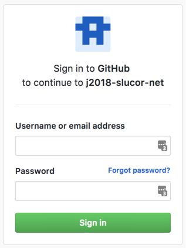
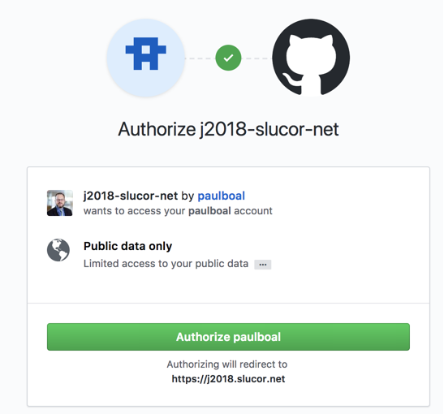

Introduction
===

For HDS5210 Python Programming for Health Data Science, we'll be using a Python programming environment called Jupyter.  Jupyter is a web based, notebook style programming environment that has become very common in data science circles.  It gives you an instantly available Python programming environment without having to download and install any software on your local machine.  (Jupyter can also be run and installed on your local machine as well, but for class, we'll be using the class server.)

GitHub
===

In addition to Python programming for data science applications, we'll also be working to develop good programming practices in this class.  One of the most fundamental programming practices is source code control, and the most common source code control system right now is something called Git.

There are many ways to use Git, but we'll be using an online service called GitHub.com.  This is available free to any developers who want to share their work publicly, as a paid service for developers who want to maintain private access to their work, and free for students to keep work private as part of a class <-- you.

In addition to using GitHub to manage your class work, you will also use your GitHub.com account to login to our Python Jupyter server.

Setup Instructions
===

We'll walk through 

1 - Create your GitHub student account
---

Note that if you already have a paid GitHub account, you don't need to do any of this step.  If you already have a gree GitHub account, but you have not certified your student status, you can do so by adding your slu.edu email address similar to the instructions below.

If you are creating a GitHub account for the first time, use the link below to join using your slu.edu email address.
https://education.github.com/pack/join

2 - Login to your GitHub account
---

Goto https://github.com and login if you aren't already signed in.

3 - Login to the SLUCOR Jupyter server
---

Goto https://j2018.slucor.net and click the "Signin with GitHub" button.

If you weren't still logged into GitHub, you'll be prompted to login.  Enter your username and password and click SignIn.

GitHub will ask if you want to allow j2018 to connect to your GitHub account. Click the Authorize button and you're in!

Accessing Python with Jupyter
===

When you login for the first time, you'll get a "Start My Server" button.  Click that to get going.

From then on, unless you manually stop your server, going to https://j2018.slucor.net will take you directly to your notebooks.

